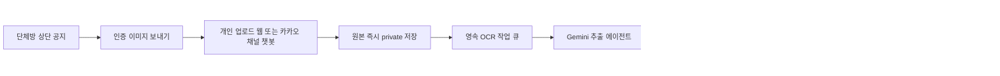

# 스내사 다음 시즌 운영·광고·OCR 에이전트 기획서

작성일: 2026-08-12  
대상: 공통 대시보드, 관리자 대시보드, 개인 인증 제출, 카카오톡 연동

## 1. 최종 결정

다음 시즌은 기존 100일 기록을 그대로 보존하면서 새 시즌을 별도 데이터로 운영한다. 공통 대시보드는 시즌 상태에 따라 `종료 → 준비 → 진행 → 종료` 화면으로 전환하며, 날짜와 정책을 코드에 직접 넣지 않는다.

광고는 카카오톡 상단 광고처럼 공통 대시보드 헤더 아래에 고정 높이의 `메인 광고 구좌`로 둔다. 한 번에 하나의 멤버 광고만 보여주고, 가운데 팝업은 관리자가 승인한 캠페인 중 조건을 만족한 한 건만 제한적으로 노출한다. 광고 오류가 인증 대시보드에 영향을 주지 않도록 데이터와 캐시를 완전히 분리한다.

카카오톡 인증 자동화는 가능하다. 다만 기존 일반 단체채팅방을 에이전트가 직접 읽는 방식은 공식 수신 API가 없어 운영안으로 채택하지 않는다. 출시 순서는 다음과 같다.

1. 단체방 상단 공지에 개인 이미지 제출 링크를 고정해 관리자 캡처를 즉시 없앤다.
2. 카카오톡 채널 챗봇의 `이미지 보안전송 플러그인`을 연결해 카카오톡 안에서 이미지 제출부터 OCR 접수까지 자동화한다.
3. 기존 단체방 화면을 읽는 Mac RPA는 필요할 때만 검수 전용 실험으로 운영하며 자동 인증 권한은 주지 않는다.

## 2. 제품 목표와 성공 기준

### 목표

- 3기 기록과 리포트를 수정 없이 계속 조회할 수 있다.
- 다음 시즌 일정·인원·리커버리·뱃지 정책을 관리자 화면에서 설정할 수 있다.
- 멤버가 자신의 서비스나 상품을 공통 대시보드에서 공정하게 알릴 수 있다.
- 운영자가 카카오톡 화면을 캡처하고 OCR에 다시 올리는 작업을 없앤다.
- OCR 오인식이나 중복 이벤트가 바로 인증 기록을 훼손하지 않는다.

### 출시 성공 기준

| 구분 | 기준 |
| --- | --- |
| 시즌 | 지난 시즌과 현재 시즌 기록이 섞이지 않고 각각 조회됨 |
| 광고 | 광고 API·이미지 장애 시 인증 대시보드는 정상 표시됨 |
| 팝업 | 동시에 하나만 열리고, 닫기·오늘 그만 보기·키보드 닫기가 동작함 |
| 노출 공정성 | 활성 캠페인별 노출 편차가 목표 범위 안에 들어옴 |
| OCR | 동일 이미지·동일 이벤트 재전송이 기록을 중복 생성하지 않음 |
| 자동 인증 | 승인된 계정과 고신뢰 기록만 자동 인증, 나머지는 검수 대기 |
| 운영 | 실패 건·재시도·마지막 처리 시각을 관리자 화면에서 확인 가능 |

## 3. 다음 시즌 대시보드

### 3.1 시즌 상태별 화면

| 상태 | 공통 대시보드 첫 화면 | 주요 행동 |
| --- | --- | --- |
| 시즌 종료 | `100일 완주` 요약, 전체 리포트, 개인 포스터 | 지난 시즌 보기·리포트 저장 |
| 준비 기간 | 다음 시즌 날짜, D-day, 신청 현황, 변경된 규칙 | 참가 신청·안내 확인 |
| 진행 중 | 오늘의 인증, 크루별 현황, 추이, 최근 뱃지 | 개인 기록 보기·인증 제출 |
| 다음 종료 | 최종 집계 잠금 안내, 리포트 생성 상태 | 전체·개인 리포트 열기 |

상단 내비게이션은 `현재 시즌`, `지난 시즌`, `시즌 리포트` 세 축으로 정리한다. 시즌 종료 화면에서 오늘 인증률을 계속 강조하지 않고, `100일의 기록이 완성됐어요`를 첫 메시지로 보여준다. 준비 기간이 시작되면 같은 위치가 다음 시즌 D-day 카드로 자연스럽게 교체된다.

### 3.2 데이터 구조 전환

현재 `lib/challenge.ts`의 단일 날짜 상수에 의존하는 구조를 시즌 중심 구조로 바꾼다.

| 데이터 | 핵심 필드 | 역할 |
| --- | --- | --- |
| `seasons` | 이름, 시작일, 종료일, 상태, 일수, 타임존 | 시즌의 단일 기준 |
| `season_participants` | 시즌, 참가자, 표시 순서, 참가 상태 | 시즌별 멤버 분리 |
| `season_rules` | 리커버리 인정값, 뱃지 버전, 인증 마감 | 정책 버전 보존 |
| 기존 인증 기록 | `season_id` 추가 | 지난 시즌과 다음 시즌 분리 |
| 기존 뱃지 이력 | `season_id`, `rule_version` 추가 | 당시 기준으로 재현 가능 |

전환 원칙은 다음과 같다.

- 3기는 `archived`로 고정하고 기존 기록을 해당 시즌에 일괄 연결한다.
- 새 시즌은 `draft`에서 준비한 뒤 관리자 확인 후 `upcoming`으로 공개한다.
- 활성 시즌은 서버에서 한 건만 선택한다.
- 시즌 종료 후 기록 수정은 관리자만 가능하고 변경 이력을 남긴다.
- 리포트는 원본 기록과 별도로 종료 시점 스냅샷을 저장해 이후 정책 변경에도 같은 결과를 보여준다.

## 4. 메인 광고 구좌

### 4.1 정확한 위치

공통 대시보드의 `DashboardSiteHeader` 바로 아래, `오늘의 인증` 메인 카드 바로 위에 둔다. sticky 헤더 안에는 넣지 않는다. 광고가 없거나 로딩에 실패하면 영역 자체를 렌더링하지 않아 기존 화면 위치가 어색하게 비지 않게 한다.

```text
공통 헤더
메인 광고 구좌
오늘의 인증 / 시즌 상태 카드
크루별 인증 현황
나머지 콘텐츠
```

### 4.2 화면 규격

| 화면 | 권장 규격 | 구성 |
| --- | --- | --- |
| 모바일 | 좌우 12px, 높이 88px | 56px 이미지, 광고 표기, 제목 1줄, 설명 1줄, CTA |
| 태블릿 | 높이 96px | 64px 이미지, 제목 1줄, 설명 최대 2줄 |
| 웹 | 최대 폭 1,280px, 높이 104px | 이미지, 브랜드·설명, 목적지 도메인, CTA |

공통 원칙:

- `멤버 광고` 또는 `AD` 표기를 항상 노출한다.
- 제목과 설명은 plain text만 허용하고 HTML은 받지 않는다.
- 이미지와 컨테이너 크기를 고정해 화면 밀림(CLS)을 막는다.
- 한 화면에 한 캠페인만 보여준다.
- 자동으로 문구가 바뀌는 캐러셀은 1차 버전에서 사용하지 않는다.
- 옆 광고는 스와이프·화살표·점 표시로 직접 볼 수 있게 한다.
- 새 페이지를 열 때 공정 노출 알고리즘으로 첫 캠페인을 선택한다.
- 외부 링크는 목적지 도메인을 표시하고 새 탭으로 연다.

### 4.3 공정 노출 방식

광고비 순위가 아니라 크루 구성원 간 공정 노출을 기본으로 한다.

1. 게시 승인·시작일·종료일을 만족하는 캠페인만 후보가 된다.
2. 같은 사용자가 같은 세션에서 본 캠페인은 우선순위를 낮춘다.
3. 전체 노출이 가장 적은 캠페인부터 선택한다.
4. 노출 수가 같으면 관리자가 지정한 우선순위와 게시 시각으로 결정한다.
5. 한 멤버가 동시에 활성화할 수 있는 메인 캠페인은 한 건으로 제한한다.

노출은 광고가 화면에 50% 이상 1초 동안 보였을 때 세션당 한 번만 집계한다. 클릭 집계 실패는 링크 이동을 막지 않는다. 개인 IP나 상세 행동 이력은 저장하지 않고 `캠페인·날짜·노출·클릭` 집계만 남긴다.

### 4.4 광고 제출과 승인

1차 버전은 `멤버 자료 전달 → 관리자 등록·검수 → 예약 게시`로 운영한다. 현재 멤버별 승인 계정 연결이 완성되지 않은 상태에서 공개 광고 등록 API를 먼저 열지 않는다.

필수 입력:

- 광고주 멤버
- 서비스 또는 상품명
- 제목 24자 이내
- 설명 48자 이내
- CTA 12자 이내
- HTTPS 목적지 URL
- 1:1 이미지 1장
- 노출 시작·종료 시각
- 중앙 팝업 사용 여부와 노출 빈도

승인 기준:

- 허위·과장 표현과 타인 저작물 여부 확인
- 의료 효능, 투자 수익, 사행성, 성인, 불법·위조 상품, 정치 광고 제외
- 플랫폼이 보증하는 상품으로 오인되지 않도록 `멤버가 직접 소개하는 광고입니다` 표시
- 수정 시 `revision`을 올리고 기존 팝업 닫기 기록과 캐시를 분리

## 5. 가운데 팝업 배너

### 5.1 노출 원칙

메인 광고 구좌와 같은 캠페인 데이터를 사용하되 `popup_enabled=true`인 승인 캠페인만 중앙 팝업 후보가 된다. 광고 등록 완료 자체가 자동 노출 조건은 아니며, 관리자가 `게시`를 눌러야 열린다.

- 대시보드 로드 후 0.8~1.2초 뒤 노출
- 시스템 안내, 개인 상세, 시즌 리포트 등 다른 모달이 열려 있으면 대기
- 모달 우선순위: 긴급 시스템 안내 → 사용자가 직접 연 화면 → 광고
- 한 번에 하나의 팝업만 표시
- 기본 빈도는 사용자별 하루 한 번
- `오늘 그만 보기`와 `닫기` 제공
- 캠페인별 `매번`, `세션 1회`, `하루 1회`, `전체 1회` 중 선택 가능

### 5.2 화면 규격과 접근성

- 모바일·웹 모두 화면 중앙 배치
- 폭 `min(92vw, 420px)`
- 최대 높이 `calc(100dvh - 32px)`
- 1:1 이미지, 짧은 제목, CTA 한 개
- 닫기 버튼 터치 영역 최소 44px
- 바깥 영역 클릭, ESC, 닫기 버튼 지원
- 팝업이 열리면 배경 스크롤을 잠그고 포커스를 팝업 안에 유지
- 닫은 뒤 원래 보던 요소로 포커스 복귀
- 이미지 대체문구와 명확한 광고 제목 제공

기존 대시보드의 여러 boolean 모달을 그대로 늘리지 않고 `activeOverlay` 단일 호스트와 우선순위 큐로 통합한다. 이렇게 해야 새로고침, 자동 이벤트, 개인 상세 클릭이 동시에 일어나도 팝업이 겹치지 않는다.

## 6. 광고 데이터와 장애 격리

### 6.1 테이블

`dashboard_promotions`에 다음 정보를 저장한다.

```text
id, season_id, participant_id
status: draft | pending | approved | published | paused | rejected
label, title, description, cta_label, target_url
image_path, starts_at, ends_at, priority, rotation_weight
popup_enabled, popup_frequency, revision
created_at, updated_at, approved_at
```

집계는 `promotion_daily_metrics(campaign_id, metric_date, impressions, clicks)`로 분리한다.

### 6.2 API와 캐시

- 공개 광고 읽기: `/api/public-dashboard-ads`
- 관리자 광고 CRUD: `/api/admin/dashboard-ads`
- 이미지 업로드: `/api/admin/dashboard-ads/image`
- 광고 데이터는 `/api/public-dashboard` payload에 합치지 않는다.
- 대시보드 본문과 광고를 병렬로 불러오되 광고 실패는 조용히 숨긴다.
- 광고 캐시와 무효화 태그를 별도로 둔다.
- 관리자 수정 후 광고 캐시만 갱신하고 인증 집계 캐시는 건드리지 않는다.

### 6.3 이미지·링크 안전성

- JPEG, PNG, WebP만 허용하고 SVG, GIF, HEIC는 제외
- 최대 3MB, 최대 4,096px 검사 후 WebP 재인코딩과 메타데이터 제거
- private Storage에 저장하고 만료되는 signed URL 사용
- 상단 광고 전송 용량은 80KB 안팎을 목표로 별도 썸네일 생성
- URL은 서버에서 HTTPS만 허용하고 `javascript:`, `data:`, `file:` 차단
- redirect 이후 목적지도 다시 검사
- 새 탭 링크에 `noopener noreferrer sponsored` 적용

## 7. 카카오톡 OCR 에이전트

### 7.1 가능한 것과 불가능한 것

카카오 공식 메시지 API는 메시지 발송 기능을 제공하지만, 기존 일반 단체채팅방의 대화·첨부 이미지를 서버가 구독하거나 과거 내역을 읽는 기능은 공개 문서에 없다. 따라서 현재 단톡방을 그대로 두고 서버 에이전트가 모든 이미지를 자동 수집하는 구조는 정식 운영안으로 삼지 않는다.

반면 카카오톡 채널 챗봇은 `이미지 보안전송 플러그인`으로 사용자가 한 번에 최대 10장의 이미지를 보낼 수 있고, 스킬 서버가 약 10분간 유효한 보안 URL을 받을 수 있다. 이 공식 흐름을 OCR 접수 채널로 사용한다.

### 7.2 권장 사용자 흐름



멤버가 할 일은 `이미지 선택 → 전송`뿐이다. 이름은 이미지 OCR 결과에 의존하지 않고 승인된 카카오 사용자 또는 로그인 계정과 참가자를 매핑해 결정한다.

### 7.3 1차: 개인 업로드 링크

가장 빨리 안정적으로 적용할 수 있는 방식이다.

- 단톡방 공지에 `/me` 제출 링크와 `인증 이미지 보내기` 버튼을 고정
- 최초 한 번 로그인·참가자 연결
- 이후 사진 여러 장 선택 → OCR 결과 확인 → 등록
- 기존 이미지 축소, Gemini 분석, 날짜·거리·시간 정규화, 중복 기록 방지 코드를 재사용
- 모바일 공유 메뉴에서 해당 웹앱으로 이미지를 넘기는 기능은 후속 PWA 단계로 확장

이 단계만 완료해도 운영자의 캡처·재업로드 작업은 사라진다.

### 7.4 2차: 카카오톡 채널 챗봇 자동 접수

1. 멤버가 채널 채팅방에서 `인증하기`를 누른다.
2. 이미지 보안전송 플러그인에서 개인정보 수집·이용에 동의한다.
3. 최대 10장의 러닝 인증 이미지를 보낸다.
4. 카카오 스킬이 `/api/integrations/kakao/run-images`로 payload를 전송한다.
5. 서버는 보안 URL이 만료되기 전에 이미지를 즉시 private Storage로 복사한다.
6. 접수 이벤트를 DB에 기록하고 `접수했어요`를 5초 안에 응답한다.
7. 영속 작업자가 OCR·검증·저장을 수행한다.
8. 결과는 개인 보드에서 확인하며, 애매한 건만 관리자 검수함으로 이동한다.

OCR을 카카오 요청 안에서 끝내려 하지 않는다. 카카오 스킬의 짧은 응답 제한과 서버리스 타임아웃을 피하기 위해 먼저 접수한 뒤 durable queue에서 처리한다. AI 챗봇 콜백 권한이 승인된 경우에만 완료 메시지 콜백을 보조 수단으로 사용한다.

### 7.5 자동 인증 안전 규칙

다음 조건을 모두 만족해야 `certified`로 자동 저장한다.

- 카카오 사용자 또는 로그인 계정이 관리자 승인 참가자에 연결됨
- 이벤트 ID와 이미지 SHA-256이 신규임
- 날짜가 시즌 범위 안에 있음
- 거리 또는 시간이 합리적인 범위에 있음
- OCR confidence가 운영 기준 이상임. 초기 권장값은 0.85
- 이름·날짜·수치 사이에 충돌이 없음
- 동일 참가자·동일 날짜에 이미 인증 기록이 없음

하나라도 만족하지 않으면 삭제하거나 임의 보정하지 않고 `needs_review`로 보낸다. 저신뢰 결과가 자동으로 뱃지·순위·리포트에 반영되지 않게 한다.

### 7.6 필수 데이터

`participant_accounts`

```text
participant_id, auth_user_id, kakao_bot_user_key
status: pending | approved | revoked
approved_at, approved_by
```

`ingestion_events`

```text
season_id, provider, external_event_id, attachment_id, participant_id
sha256, storage_path
status: received | queued | processing | needs_review | certified | failed
attempts, last_error, lease_until, received_at, processed_at
```

필수 제약:

- `UNIQUE(provider, external_event_id, attachment_id)`
- `UNIQUE(season_id, participant_id, sha256)` 또는 동등한 해시 중복 정책
- 기존 `UNIQUE(user_id, participant_id, record_date)` 유지

### 7.7 재시도와 장애 대응

- 429와 일시적 5xx는 지수 백오프로 재시도
- 작업 lease가 만료되면 다른 worker가 이어서 처리
- 최대 재시도 초과 건은 실패 큐로 이동
- 원본 다운로드 실패와 OCR 실패를 구분해 표시
- 관리자 화면에 대기·처리·검수·실패 건수, 마지막 성공 시각, 재처리 버튼 제공
- 전체 자동 수집을 즉시 멈추는 kill switch 제공
- OCR 공급자 장애 시 이미지는 보존하고 큐만 정지
- 작업 완료 후에만 공개 대시보드 캐시를 무효화

### 7.8 보안과 개인정보

- 카카오 스킬에 설정한 비밀 헤더를 검증하고 외부 공개 업로드를 차단
- 요청 시각 허용 범위와 이벤트 중복을 검사해 재전송 공격 방지
- 보안 이미지 URL은 HTTPS와 허용된 Kakao CDN 호스트만 수락
- redirect 차단, 다운로드 timeout, 3MB 제한, MIME과 magic bytes 검사
- 원본은 private Storage에 두고 짧은 signed URL로만 관리자에게 표시
- 보관 기간을 운영 약관에 명시하고, 예시로 원본 30일 후 자동 삭제
- 참가자 연결·관리자 수정·원본 열람 기록을 감사 로그에 남김
- 서비스 종료나 동의 철회 시 연결 정보와 원본 삭제 절차 제공

### 7.9 기존 단톡방 RPA 대안

Mac에서 카카오톡 화면을 열고 새 이미지를 감지·저장하는 에이전트를 만들 수는 있다. 하지만 UI 변경, 로그인 만료, 채팅방 스크롤 누락, 중복 다운로드, 개인정보와 운영정책 위험이 크다.

따라서 RPA를 시험한다면 다음 제한을 둔다.

- 별도 운영 계정과 전용 Mac에서만 실행
- 자동 저장 결과는 모두 `needs_review`
- 자동 `certified` 금지
- heartbeat, 마지막 수집 시각, 화면 변경 감지, kill switch 제공
- 원본 메시지 삭제나 채팅 전송 권한은 주지 않음
- 2주 파일럿 후 누락률·중복률이 목표를 넘으면 즉시 중단

## 8. 현재 코드의 선행 보완점

현재 코드에는 재사용할 수 있는 OCR 기반이 충분하지만, 외부 자동 접수 전에 아래를 먼저 고쳐야 한다.

| 우선순위 | 보완 | 현재 연결 지점 |
| --- | --- | --- |
| P0 | 이름 직접 입력 대신 관리자 승인 계정 연결 | `app/api/me/route.ts`, `lib/admin-data.ts` |
| P0 | confidence 기반 자동 인증 gate | `app/api/me/records/analyze/route.ts`, `app/api/records/analyze/route.ts` |
| P0 | 이미지 해시·이벤트 ID 멱등성 | `daily_run_records`, 신규 `ingestion_events` |
| P0 | 이미지별 영속 큐·재시도 | 현재 `upload_batches` 확장 또는 별도 작업 테이블 |
| P1 | OCR·판정·저장 서비스 공통화 | 중복된 두 `analyze/route.ts`를 `lib/run-record-ingestion.ts`로 분리 |
| P1 | 관리자 자동화 모니터 | `app/admin/page.tsx`에 수집 상태·재처리 추가 |

## 9. 개발 순서

### 단계 A — 시즌 구조와 종료 화면

- `seasons`, `season_participants`, `season_rules` 도입
- 3기 데이터 마이그레이션과 읽기 전용 보존
- 종료·준비·진행 상태별 공통 대시보드 전환
- 이전 시즌 선택과 리포트 연결

완료 기준: 새 시즌을 draft로 만들어도 3기 대시보드와 포스터 수치가 바뀌지 않는다.

### 단계 B — 광고 MVP

- 광고 테이블, private Storage, 관리자 CRUD·승인·예약
- 헤더 아래 메인 광고 구좌
- 광고 API·캐시 장애 격리
- 공정 노출과 최소 집계

완료 기준: 광고 API를 강제로 실패시켜도 인증 대시보드가 정상 작동한다.

### 단계 C — 중앙 팝업

- 단일 오버레이 호스트와 우선순위 큐
- 중앙 팝업, 빈도 제어, 오늘 그만 보기
- 모바일·키보드·스크린리더 검증

완료 기준: 자동 광고, 시즌 안내, 개인 상세가 동시에 발생해도 하나만 열린다.

### 단계 D — 개인 제출 안정화

- 관리자 승인 참가자 계정 연결
- `/me`를 사진 선택 중심의 한 화면으로 단순화
- confidence gate, 해시 중복 검사, 검수 흐름

완료 기준: 멤버가 단톡 공지 링크에서 이미지를 올리면 운영자 재업로드 없이 기록이 처리된다.

### 단계 E — 카카오 채널 OCR 에이전트

- 개발 채널·개발 봇에서 이미지 보안전송 payload PoC
- 만료 전 이미지 복사, 영속 큐, OCR worker
- 관리자 모니터·재시도·감사로그
- 테스트 채널 통과 후 운영 채널 배포

완료 기준: 중복 전송·OCR 429·worker 중단·이미지 URL 만료 상황을 복구하고, 애매한 결과는 자동 인증되지 않는다.

## 10. 출시 전 점검표

- [ ] 3기 전체·개인 리포트 회귀 테스트
- [ ] 시즌별 기록·뱃지·리커버리 집계 분리 확인
- [ ] 광고 없음·만료·이미지 404·API 500 fallback 확인
- [ ] 광고 HTTPS·redirect·파일 형식·용량 검사
- [ ] 모바일 360/390px, 태블릿 768px, 웹 1280px 확인
- [ ] 팝업 중첩, ESC, 포커스, 배경 스크롤, 오늘 그만 보기 확인
- [ ] 계정 사칭·중복 이벤트·중복 이미지 방지 테스트
- [ ] 저신뢰 OCR이 검수 대기로 이동하는지 확인
- [ ] 429/5xx 재시도와 실패 큐 확인
- [ ] private 원본 접근·보관기간·삭제 작업 확인
- [ ] 개발 카카오 채널에서 먼저 전체 흐름 검증
- [ ] 운영 배포 후 API 반복 요청과 캐시 상태 확인

## 11. 공식 참고 자료

- [카카오톡 메시지 REST API](https://developers.kakao.com/docs/en/kakaotalk-message/rest-api): 공식 메시지 기능은 나에게·친구에게 보내기 중심이다.
- [카카오 챗봇 이미지 보안전송 플러그인](https://kakaobusiness.gitbook.io/main/tool/chatbot/skill_guide/apply_skill_to_plugin): 최대 10장, 개인정보 동의, 약 10분간 유효한 보안 URL payload를 제공한다.
- [카카오 챗봇 스킬 만들기](https://kakaobusiness.gitbook.io/main/tool/chatbot/skill_guide/make_skill): 스킬 서버와 JSON POST 연동 방식.
- [카카오 AI 챗봇 콜백 가이드](https://kakaobusiness.gitbook.io/main/tool/chatbot/skill_guide/ai_chatbot_callback_guide): 5초를 넘는 처리와 1회성 콜백의 조건 및 승인 절차.
- [카카오 챗봇 배포](https://kakaobusiness.gitbook.io/main/tool/chatbot/main_notions/deploy): 개발 채널 검증 후 운영 채널에 배포하는 절차.
